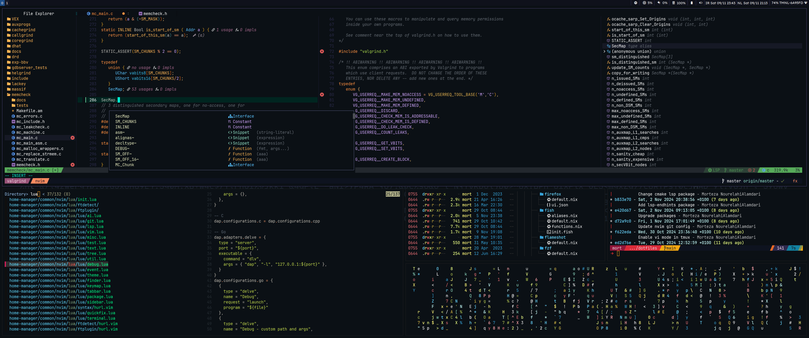

+++
title = "Dotfiles"
draft = false
[extra]
comment = true
+++

Here is my configuration for the environment. I aimed to keep it as minimal and straightforward as possible.
You can find it on GitHub at the following [link](https://github.com/mortymacs/dotfiles).

    
    
    

My environment config. I tried to keep it minimal and simple as much as I could.

## General config

| Category | Tool |
|----------|------|
| Distro | [NixOS](https://nixos.org/) |
| Window Manager | [Sway](https://github.com/swaywm/sway) |
| Status Bar | [i3status-rust](https://github.com/greshake/i3status-rust) |
| Mako | [Mako](https://github.com/emersion/mako) |
| Terminal | [Alacritty](https://alacritty.org) |
| Shell | [Fish](https://fishshell.com) |
| Shell Prompt | [Starship](https://github.com/starship/starship) |
| Terminal Multiplexer | [Tmux](https://github.com/tmux/tmux) |
| Editor/IDE | [Neovim](https://github.com/neovim/neovim) |
| DB | [dbcli tools](https://github.com/dbcli) |
| Fonts | Display: [Lexend](https://github.com/googlefonts/lexend), [VarizMatn](https://github.com/rastikerdar/vazirmatn), Monospace: [JetBrainsMono Nerd Font](https://www.nerdfonts.com), [Noto Color Emoji](https://github.com/C1710/blobmoji) |
| File Manager | [Broot](https://github.com/Canop/broot) |
| Launcher | [Rofi-Wayland](https://github.com/lbonn/rofi) |
| Browser | [Firefox](https://www.mozilla.org) |
| GTK Theme | [Yaru](https://github.com/ubuntu/yaru) |
| Icon | [Yaru](https://github.com/ubuntu/yaru) |
| Wallpaper | Created by me, under the same license as this repository. |

#### Screenshot

    

Feel free to explore additional details on my [GitHub repository](https://github.com/mortymacs/dotfiles).
